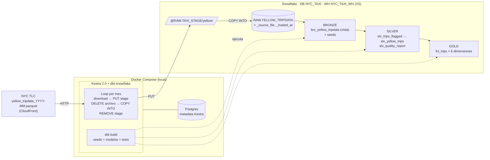

# Diagrama de arquitectura

| Componente | Rol | Tecnología |
|---|---|---|
| Orquestación / ingesta (E + L) | Descarga cada mes y lo carga a RAW de forma idempotente | Kestra 2.0 en Docker |
| Almacenamiento | Stage interno + tabla RAW | Snowflake |
| Transformación (T) | Bronze → Silver → Gold + tests | dbt-core + dbt-snowflake (dentro de la imagen de Kestra) |
| Metadata del orquestador | Estado de flows y ejecuciones | Postgres 16 |
