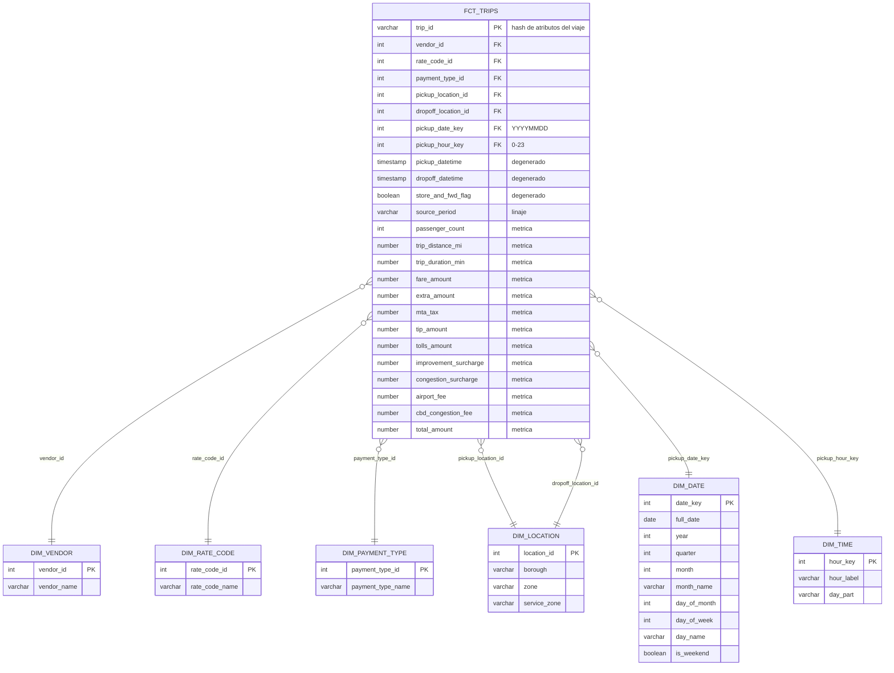

# Diagrama del esquema estrella (capa GOLD)

**Grano de `fct_trips`:** un viaje válido de Yellow Taxi (una fila por `trip_id`).

- `DIM_LOCATION` es una *role-playing dimension*: la misma tabla responde como zona de origen y de destino.
- Cada dimensión de catálogo incluye un miembro "desconocido" (`vendor -1`, `rate_code 99`, `payment 5`, `location 264`) para que toda FK tenga pareja y el test `relationships` sea válido sin descartar viajes.
